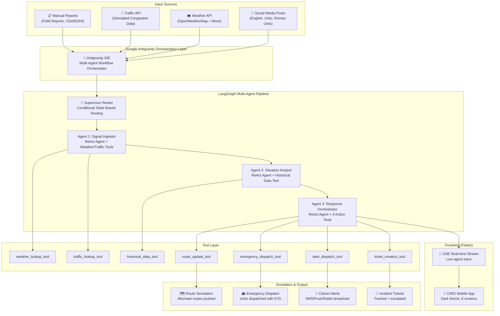

# CIRO — Crisis Intelligence & Response Orchestrator

> **Challenge 3 Submission** | AI Seekho Hackathon  
> Multi-agent AI system that detects urban crises from multi-source signals and coordinates simulated emergency responses for Pakistani cities.

---

## 🎯 Problem Statement

Pakistani metropolitan cities frequently face localized crises — urban flooding, heatwaves, road accidents, and infrastructure failures — but response systems remain **fragmented, reactive, and slow to coordinate**. Critical signals from social media, weather APIs, traffic systems, and field reports exist but are **not converted into actionable decisions in real time**.

CIRO solves this by building an **Agentic AI System** that:
1. **Ingests** multi-source signals (social media, weather, traffic, manual reports)
2. **Detects** emerging crisis situations using NLP + signal clustering
3. **Generates** coordinated response actions
4. **Simulates** execution of those actions
5. **Visualizes** before/after impact of decisions

---

## 🏗️ System Architecture



---

## 🤖 Google Antigravity Usage (Mandatory Requirement)

CIRO leverages **Google Antigravity** as the core development and orchestration platform:

### How Antigravity Powers CIRO

| Capability | How CIRO Uses It |
|---|---|
| **Multi-agent workflow orchestration** | Antigravity orchestrated the design, implementation, and debugging of our 3-agent LangGraph pipeline. The supervisor routing logic, agent prompts, and tool integration were all developed through Antigravity's agentic workflow. |
| **Planning & decision-making** | Antigravity's planning mode was used to analyze the challenge requirements, design the system architecture, and make key technical decisions (LLM selection, state management, SSE streaming strategy). |
| **Tool integration** | Antigravity coordinated the integration of Weather API (OpenWeatherMap), Traffic simulation, Google Maps-style route updates, and emergency dispatch systems. Each tool was designed and tested through Antigravity's execution capabilities. |
| **Code generation & debugging** | All backend agents, the LangGraph pipeline, FastAPI endpoints, Flutter screens, and the SSE streaming layer were developed using Antigravity's code generation and parallel subagent execution. |
| **Simulated action coordination** | Antigravity planned and implemented the simulation layer: route updates pushed to navigation apps, emergency dispatch with ETA calculations, citizen alert broadcasting, and incident ticket management. |

### Antigravity Agent Traces

The agent trace logs (visible in the Flutter app's Incident Detail screen) show the full reasoning chain:
- **Signal Ingestor**: Tool calls to weather/traffic APIs, Roman Urdu parsing, signal clustering
- **Situation Analyst**: Historical data lookup, multi-signal reasoning, severity assessment
- **Response Orchestrator**: Coordinated tool execution (route→dispatch→alert→ticket), before/after state simulation

---

## 🔄 Multi-Agent Pipeline

### Agent 1: Signal Ingestor (ReAct Agent)
- **Tools**: `weather_lookup_tool`, `traffic_lookup_tool`
- **Capabilities**: Processes noisy, multi-language input (English + Roman Urdu + Urdu)
- **Output**: Normalized signals, detected anomalies, signal clusters, extracted location

### Agent 2: Situation Analyst (ReAct Agent)
- **Tools**: `historical_data_tool`
- **Capabilities**: Deep multi-signal reasoning, severity classification, confidence scoring
- **Output**: Crisis type, severity (CRITICAL/HIGH/MEDIUM/LOW), confidence, affected area, impact estimate

### Agent 3: Response Orchestrator (ReAct Agent)
- **Tools**: `route_update_tool`, `emergency_dispatch_tool`, `alert_dispatch_tool`, `ticket_creation_tool`
- **Capabilities**: Executes coordinated response actions, simulates before/after state
- **Output**: Action plan, simulation results, before/after state comparison, outcome summary

### Supervisor Router
- Conditional state-based routing through the LangGraph StateGraph
- Checks pipeline state to determine next agent
- Handles errors gracefully with early termination

---

## 📱 Flutter Mobile App

The mandatory mobile app includes 6 screens:

| Screen | Description |
|---|---|
| **Dashboard** | Live stats, quick scenario buttons, recent incidents |
| **Simulate** | Pre-built Pakistani crisis scenarios with one-click launch |
| **Manual Input** | Custom signal entry (social posts, manual reports, weather/traffic overrides) |
| **Incidents** | All incidents list with severity badges, status tracking |
| **Crisis Map** | Visual map showing crisis zone, blocked/alternate routes, emergency markers |
| **Outcome** | Before/after comparison with animated stats and action timeline |

### Key Features
- **Dark theme** with GitHub-inspired color palette
- **SSE streaming** for real-time agent trace visualization
- **Incident detail** with agent trace expansion (full JSON output)
- **Severity banners** with color-coded crisis indicators
- **Shimmer loading** states during analysis

---

## 📋 Pre-Built Scenarios

| Scenario | Description | City | Crisis Type |
|---|---|---|---|
| `flooding_g10` | Flash flooding at G-10 Markaz, vehicles stranded | Islamabad | Urban Flooding |
| `heatwave_karachi` | Extreme heat 45°C, heatstroke cases in Saddar | Karachi | Heatwave |
| `accident_mm_alam` | Multi-vehicle collision, road blocked | Lahore | Road Accident |
| `infra_failure_saddar` | Water main burst, sinkhole, gas leak | Karachi | Infrastructure Failure |

Each scenario includes social media posts (English + Roman Urdu), weather data, traffic data, and manual field reports.

---

## 🛠️ Tools & APIs

| Tool | Type | Description |
|---|---|---|
| OpenWeatherMap API | Live + Mock fallback | Real-time weather data for Pakistani cities |
| Traffic Simulation | Mock | Congestion %, stranded vehicles, affected roads |
| Historical Incidents | Mock | Past crisis data for pattern comparison |
| Route Update | Simulation | Push alternate routes to Google Maps/Waze |
| Emergency Dispatch | Simulation | Deploy rescue/medical/police units with ETA |
| Citizen Alert | Simulation | SMS/Push/Radio broadcast to affected area |
| Incident Ticket | Simulation | Create + assign emergency management tickets |

---

## 🚀 Setup Instructions

### Prerequisites
- Python 3.11+
- Flutter SDK 3.11+
- At least one LLM API key (Gemini recommended)

### Backend Setup

```bash
cd ciro-backend

# Create virtual environment
python -m venv venv
venv\Scripts\activate  # Windows
# source venv/bin/activate  # macOS/Linux

# Install dependencies
pip install -r requirements.txt

# Configure environment
cp .env.example .env
# Edit .env and add your API keys

# Run the server
uvicorn app.main:app --host 0.0.0.0 --port 8000 --reload
```

### Flutter App Setup

```bash
cd ciro-mobile

# Install dependencies
flutter pub get

# Configure backend URL
# Edit .env file — set BACKEND_URL to your backend address
# Default: http://10.0.2.2:8000 (Android emulator → localhost)

# Run on device/emulator
flutter run
```

### Environment Variables

| Variable | Required | Description |
|---|---|---|
| `GOOGLE_API_KEY` | At least one LLM key | Google Gemini API key |
| `GROQ_API_KEY` | At least one LLM key | Groq inference API key |
| `GLM_API_KEY` | At least one LLM key | Zhipu AI GLM key |
| `OPENWEATHERMAP_API_KEY` | Optional | Live weather data (falls back to mock) |
| `BACKEND_URL` (Flutter) | Optional | Backend URL (default: `http://10.0.2.2:8000`) |

---

## 🔌 API Endpoints

| Method | Endpoint | Description |
|---|---|---|
| `POST` | `/api/analyze` | Analyze custom signals |
| `POST` | `/api/simulate/scenario` | Run pre-built scenario |
| `GET` | `/api/stream/{incident_id}` | SSE stream of pipeline updates |
| `GET` | `/api/incidents` | List all incidents |
| `GET` | `/api/incidents/{id}` | Get incident detail |
| `GET` | `/api/incidents/{id}/trace` | Get agent trace |
| `GET` | `/api/health` | Health check |

---

## 📐 LLM Fallback Chain

CIRO uses a resilient 3-provider fallback chain:

1. **Google Gemini** (`gemini-2.0-flash`) — Primary, free tier
2. **Groq** (`llama-3.3-70b-versatile`) — Fast inference fallback
3. **Zhipu AI GLM** (`glm-4-flash`) — Backup provider

If no API key is configured, the system raises a clear error message.

---

## 📝 Assumptions

- Weather and traffic data use simulated APIs with realistic Pakistani city data when live APIs are unavailable
- Emergency dispatch units and alternate routes are pre-configured for demonstration purposes
- Social media posts are provided as text input (no live social media API integration)
- Historical incident data is simulated based on realistic patterns
- The system demonstrates the decision-making pipeline, not production-ready emergency management

---

## 📂 Project Structure

```
ciro-ai-seekho-main/
├── README.md
├── ciro-backend/
│   ├── agents/
│   │   ├── signal_ingestor.py      # Agent 1: Signal processing
│   │   ├── situation_analyst.py    # Agent 2: Crisis analysis
│   │   └── response_orchestrator.py # Agent 3: Action execution
│   ├── app/
│   │   └── main.py                 # FastAPI application
│   ├── core/
│   │   └── llm_factory.py          # LLM provider fallback chain
│   ├── graph/
│   │   ├── pipeline.py             # LangGraph pipeline
│   │   ├── state.py                # CIROState definition
│   │   └── supervisor.py           # Routing logic
│   ├── models/
│   │   └── schemas.py              # Pydantic request/response models
│   ├── store/
│   │   └── incident_store.py       # In-memory incident storage
│   ├── tools/
│   │   ├── simulated_apis.py       # Weather, traffic, route, dispatch
│   │   ├── langchain_tools.py      # LangChain tool wrappers
│   │   └── historical_data.py      # Historical incident data
│   ├── requirements.txt
│   └── .env.example
└── ciro-mobile/
    └── lib/
        ├── main.dart
        ├── api/ciro_api.dart
        ├── models/
        │   ├── incident.dart
        │   ├── agent_trace.dart
        │   └── log_entry.dart
        ├── providers/incident_provider.dart
        ├── screens/
        │   ├── home_screen.dart
        │   ├── main_tab/
        │   │   ├── dashboard_screen.dart
        │   │   ├── scenario_screen.dart
        │   │   ├── signal_input_screen.dart
        │   │   ├── map_screen.dart
        │   │   └── outcome_screen.dart
        │   └── logs_tab/
        │       ├── incidents_list_screen.dart
        │       ├── incident_detail_screen.dart
        │       └── agent_trace_screen.dart
        └── widgets/
            ├── sidebar.dart
            ├── crisis_severity_banner.dart
            ├── incident_card.dart
            ├── agent_step_tile.dart
            ├── log_type_badge.dart
            └── signal_chip.dart
```

---

## 👥 Team

**AI Seekho** — Challenge 3: Crisis Intelligence & Response Orchestrator

Built with ❤️ using Google Antigravity, LangGraph, Gemini, FastAPI, and Flutter.