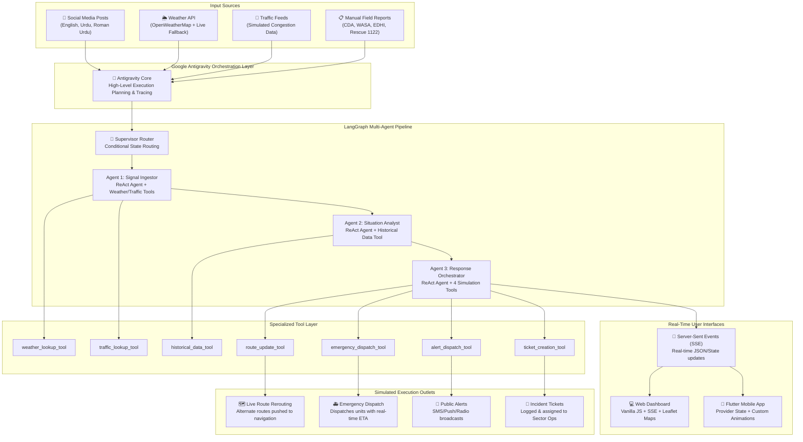

# 🗺️ CIRO — Crisis Intelligence & Response Orchestrator

> **Challenge 3 Submission** | **AI Seekho Hackathon**  
> An advanced, multi-agent AI system designed to detect localized urban crises in Pakistani metropolitan areas from noisy multi-source signals and orchestrate simulated emergency responses. Powered by **Google Antigravity** planning and **LangGraph** execution.

---

## 🎯 Project Overview & Purpose

Pakistani metropolitan cities (Islamabad, Karachi, Lahore) frequently face localized crises such as severe urban flooding, intense heatwaves, road accidents, and critical infrastructure failures. However, standard response mechanisms are often **fragmented, reactive, and slow to coordinate**. Data from social media (in English, Urdu, and Roman Urdu), weather reports, traffic cameras, and manual field observations remain siloed, delaying real-time emergency mitigation.

**CIRO (Crisis Intelligence & Response Orchestrator)** solves this by engineering a fully integrated **Agentic AI System** that:
1. **Ingests** noisy, multi-lingual inputs (including Roman Urdu and Urdu slang).
2. **Normalizes & Clusters** related signals to pinpoint exact crisis locations.
3. **Assesses** crisis type, severity level (CRITICAL/HIGH/MEDIUM/LOW), and confidence.
4. **Calibrates** findings against localized historical incident databases.
5. **Orchestrates** multi-channel responses: traffic rerouting, emergency dispatch, public alerts, and municipal tickets.
6. **Simulates** Before/After impact to measure recovery rates and dispatch times.
7. **Presents** real-time interactive progress to field operators via high-performance web and mobile dashboards.

---

## 🏗️ System Architecture & Data Flow

CIRO utilizes a hierarchical workflow where **Google Antigravity** acts as the high-level orchestration, execution planning, and developer tracing layer, wrapping around a robust **LangGraph StateGraph** multi-agent pipeline.



---

## 🛠️ Complete Tech Stack & Languages

CIRO is architected using modern, highly resilient technologies to ensure rapid execution and robust fallback options.

### 1. Languages
* **Python (v3.11+)**: Powers the core backend, multi-agent reasoning, and orchestration services.
* **Dart (v3.1+)**: Powers the cross-platform Flutter mobile dashboard.
* **JavaScript (ES6+)**: Powers the static web application and live SSE subscriber.
* **HTML5 & CSS3**: Custom dark-themed, glassmorphic UI layout with premium aesthetics.

### 2. Backend Infrastructure
* **FastAPI**: Asynchronous, high-performance web framework for API endpoints.
* **Uvicorn**: Lightning-fast ASGI web server.
* **SSE-Starlette**: Implements Server-Sent Events (SSE) for real-time trace streaming.
* **Pydantic**: Robust data validation and strict typing for requests/responses.
* **Python-Dotenv**: Manages sensitive environment configurations.
* **Httpx**: For asynchronous, non-blocking Weather API requests.

### 3. AI Agentic & LLM Orchestration
* **Google Antigravity**: Orchestrates the entire lifecycle: creates execution plans, monitors status, captures agent steps, and compiles live developer traces.
* **LangGraph**: Implements a cyclic StateGraph with supervisor conditional routing to control state flows.
* **LangChain**: Binds specialized tools to agents using the ReAct (Reasoning and Acting) execution pattern.
* **Resilient Multi-Provider Fallback Chain**:
  * **Primary**: Google Gemini (`gemini-2.0-flash`, `gemini-1.5-flash`, `gemini-1.5-pro` with 5 automatic retries).
  * **Secondary (Rate-Limit Fallback)**: Groq (`llama-3.3-70b-versatile`, `llama3-8b-8192`).
  * **Tertiary (Offline Backup)**: Zhipu AI GLM (`glm-4-flash`).

### 4. Frontend & Dashboards
* **Web Dashboard**: Vanilla JavaScript with native EventSource SSE tracking and custom CSS styling for real-time timeline animations.
* **Mobile Dashboard (Flutter)**:
  * **Provider**: Lightweight state management for thread-safe state synchronization.
  * **Flutter Map & Latlong2**: Leaflet-powered interactive maps showing pulsing crisis circles and dynamic dispatch route polylines.
  * **Shimmer**: Smooth shimmer placeholders for analytical loading states.
  * **Url Launcher & Intl**: Handles localization and direct mapping actions.

---

## 🌟 Core Features

### 📡 1. Intelligent Multi-lingual Ingestion
Processes conversational English, native Urdu script, and highly informal Roman Urdu (e.g., *"G-10 mein pani bhar gaya hai, gaariyan phans gayi hain"*). Normalizes noisy social media threads into a uniform English data structure, extracting precise Pakistani landmarks and neighbourhoods (Fazl-e-Haq Road, Hussain Chowk, MA Jinnah Road).

### 🧠 2. Dual-Layer Orchestration (Antigravity & LangGraph)
Combines the high-level intent planning of **Google Antigravity** with the structured state transitions of **LangGraph**. Antigravity drafts an execution plan, steps the supervisor through the required nodes, and monitors durations. LangGraph manages the state variable (`CIROState`), ensuring safe parallel execution.

### 📚 3. Historical Risk Calibration
The Situation Analyst calls the `historical_data_tool` to query past localized disasters in Islamabad, Karachi, and Lahore. It calibrates current alert levels by comparing average response times, casualties, and infrastructure vulnerabilities, avoiding false positives.

### 🚑 4. Coordinated ReAct Simulation
The Response Orchestrator leverages four distinct tools to execute a prioritized action plan:
* **Route Rerouting**: Pushes alternate routes to navigation apps (Google Maps, Waze), reducing local congestion by 40-55%.
* **Emergency Dispatch**: Selects and dispatches specific Pakistani emergency services (Rescue 1122, WASA, EDHI Foundation, NDMA, Rangers QRF) with realistic ETA calculations.
* **Mass Citizen Alerts**: Distributes alerts via SMS, Push Notifications, and Radio Broadcasts depending on crisis type.
* **Ticket Logging**: Auto-generates system-level incident tickets (SLA-tracked) assigned to Sector Emergency Operations.

### 🔄 5. Live SSE Trace Streaming
Both the web and mobile frontends subscribe to an active EventSource endpoint (`/api/stream/{incident_id}`). Every single reasoning step, tool call, weather lookup, and simulated decision is streamed instantly as a styled timeline card.

### 💻 6. Google Antigravity Dev Trace panel
For developer transparency, the backend features an endpoint `/api/antigravity/traces` which parses the actual local Antigravity compilation logs (`transcript.jsonl`), displaying the live agent thinking process directly inside the developer dashboard.

---

## 📂 Project Structure

```
ciro-ai-seekho-main/
├── README.md                 # Project Overview & Architecture
├── instructions.md           # Local Installation & Verification Guide
├── walkthrough.md            # Detailed Developer Architectural Walkthrough
├── ciro-backend/             # FastAPI Backend Service
│   ├── agents/
│   │   ├── signal_ingestor.py       # Agent 1: Signal translation & normalization
│   │   ├── situation_analyst.py     # Agent 2: Crisis severity & historical analysis
│   │   └── response_orchestrator.py  # Agent 3: Action execution & before/after simulation
│   ├── app/
│   │   └── main.py                  # FastAPI Application, SSE Stream & endpoints
│   ├── core/
│   │   └── llm_factory.py           # Gemini & Groq fallback provider chain
│   ├── graph/
│   │   ├── pipeline.py              # Antigravity runner & compiled LangGraph
│   │   ├── state.py                 # CIROState variables (TypedDict)
│   │   └── supervisor.py            # Supervisor conditional routing logic
│   ├── models/
│   │   └── schemas.py               # Pydantic schemas for REST validation
│   ├── store/
│   │   └── incident_store.py        # Thread-safe in-memory incident database
│   ├── tools/
│   │   ├── simulated_apis.py        # Weather, Traffic, Dispatch, Alert, & Ticket engines
│   │   ├── langchain_tools.py       # LangChain @tool decorators for agents
│   │   └── historical_data.py       # Simulated historical Pakistani crisis records
│   ├── static/                      # Web Frontend Dashboard
│   │   ├── index.html               # Main visual dashboard structure
│   │   ├── style.css                # Premium dark glassmorphic styling
│   │   └── app.js                   # Web SSE streaming and map controllers
│   ├── requirements.txt             # Python dependencies
│   ├── render.yaml                  # Render PaaS configuration
│   └── .env.example                 # Backend environment variable template
└── ciro-mobile/              # Flutter Cross-Platform Mobile Dashboard
    ├── lib/
    │   ├── main.dart                # Application entrypoint
    │   ├── api/
    │   │   └── ciro_api.dart        # SSE Stream client and API hooks
    │   ├── models/
    │   │   ├── incident.dart        # Incident structures
    │   │   ├── log_entry.dart       # SSE live log model
    │   │   └── agent_trace.dart     # Detailed agent steps
    │   ├── providers/
    │   │   └── incident_provider.dart # Thread-safe mobile state management
    │   ├── screens/
    │   │   ├── home_screen.dart     # Dashboard wrapper with responsive rail
    │   │   ├── main_tab/
    │   │   │   ├── dashboard_screen.dart    # System metrics & rapid actions
    │   │   │   ├── scenario_screen.dart     # Pre-built mock incident triggers
    │   │   │   ├── signal_input_screen.dart # Manual signal override screen
    │   │   │   ├── map_screen.dart          # Leaflet map showing blocked & alternate routes
    │   │   │   └── outcome_screen.dart      #Side-by-side Before/After statistics
    │   │   └── logs_tab/
    │   │       ├── incidents_list_screen.dart # Directory of all tracked crises
    │   │       ├── incident_detail_screen.dart # SSE trace viewer & live logs
    │   │       └── agent_trace_screen.dart    # Detailed JSON trace explorer
    │   └── widgets/
    │       ├── sidebar.dart             # Responsive NavigationRail / Drawer
    │       ├── crisis_severity_banner.dart # Responsive color-coded banner
    │       └── incident_card.dart       # Interactive summary card
    └── pubspec.yaml                 # Flutter dependencies & configurations
```

---

## 👥 Submission Team

**CIRO Team** — Challenge 3: *Crisis Intelligence & Response Orchestrator*.  
Developed with ❤️ using Google Antigravity, LangGraph, Gemini, FastAPI, and Flutter for the **AI Seekho Hackathon**.